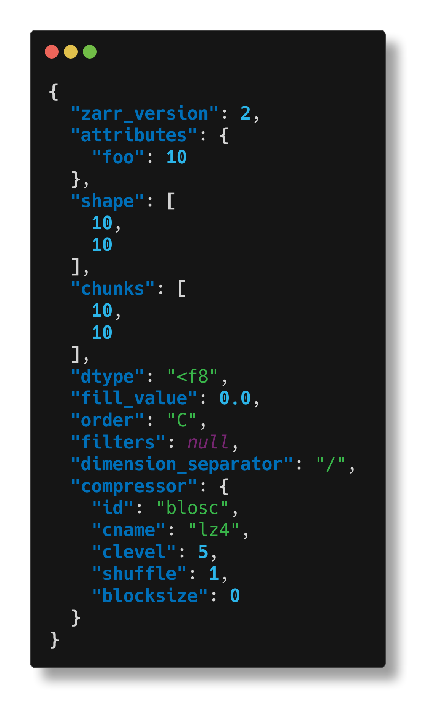
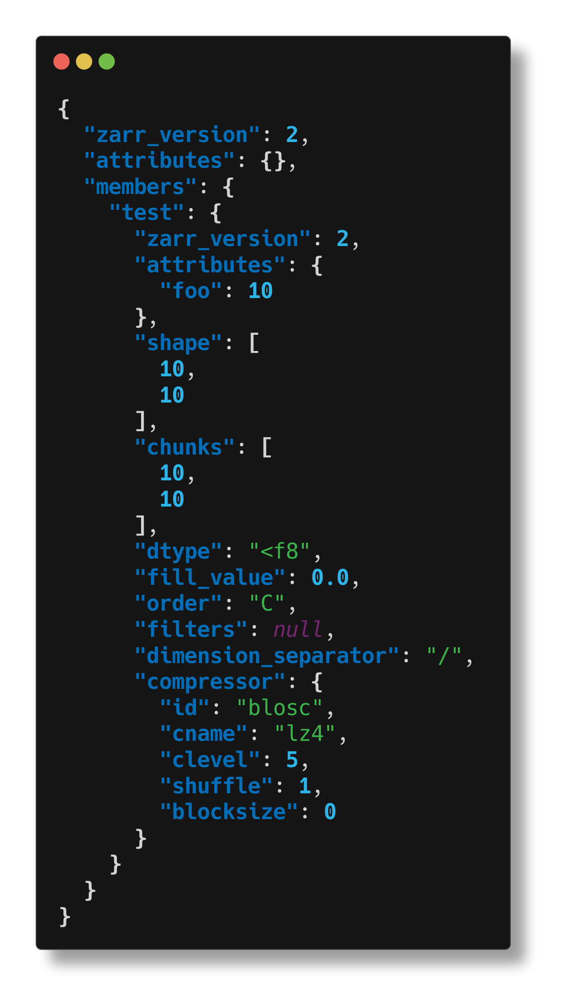
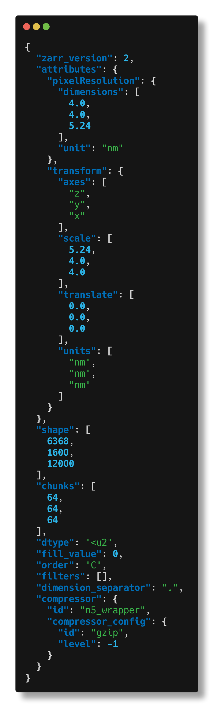
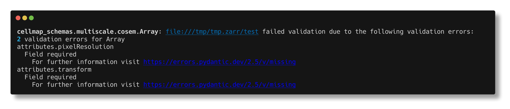
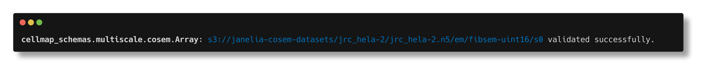

# Welcome to cellmap-schemas

This project contains a [`pydantic`](https://docs.pydantic.dev/latest/)-based python library that formalizes data structures developed by the [Cellmap](https://www.janelia.org/project-team/cellmap) project team at [Janelia Research Campus](https://www.janelia.org/).

Cellmap works with large (multi-TB) imaging datasets. We store our images with chunked array formats like [N5](https://github.com/saalfeldlab/n5) and [Zarr](https://zarr.readthedocs.io/en/stable/), because these formats support performant I/O operations at the terabyte scale, and also because these file formats give developers a wide range of freedom in how arrays are organized, and what metadata is present. But with that freedom comes the need for applications to check whether the N5 or Zarr hierarchies they consume are correctly structured. To address this problem, this library provides [Pydantic models](https://docs.pydantic.dev/latest/) of Cellmap-specific N5 / Zarr hierarchies which can be used for validating N5 / Zarr data.

## Example: creating an N5 hierarchy for Neuroglancer

In this example, we create an N5 hierarchy that complies with the [Neuroglancer N5 convention](https://github.com/google/neuroglancer/issues/176#issuecomment-553027775):

```python
from pydantic_zarr.v2 import ArraySpec
from cellmap_schemas.multiscale.neuroglancer_n5 import Group, PixelResolution, GroupMetadata
import numpy as np

# define a toy multiscale image
data = np.arange(16).reshape(4,4)
data_ds = data[::2, ::2]
arrays = {
    's0': ArraySpec.from_array(data),
    's1': ArraySpec.from_array(data_ds)
    }
ngroup = Group(
    members=arrays, 
    attributes=GroupMetadata(
        scales=[[1,1], [2,2]], 
        axes=['x','y'],
        units=['nm','nm'],
        pixelResolution= PixelResolution(dimensions=[4,4], unit='nm')))

# prepare the hiearchy for writing data by calling 
# stored_group = ngroup.to_zarr(
#   zarr.N5FSStore('path/to/n5/root.n5'), 
#   path='foo')
# then write data, e.g.
# stored_group['s0'][:] = data
# stored_group['s1'][:] = data_ds

```

## Example: validating a container with the cli

This package ships with a command-line tool than can be used for inspection or validation of N5 / Zarr containers.

### `cellmap-schemas inspect`

The command `cellmap-schemas inspect <url>` will print a summary of a Zarr array or group located at `<url>` to the command line.

In the following example, we create an array locally, then inspect it:

```python
import zarr
store = zarr.NestedDirectoryStore('/tmp/tmp.zarr')
array = zarr.open(store, path='test', shape=(10,10))
array.attrs.put({'foo': 10})
```

```bash
$ cellmap-schemas inspect /tmp/tmp.zarr/test
```



We can also inspect the group that contains this array:

```bash
$ cellmap-schemas inspect /tmp/tmp.zarr/
```



And we can inspect arrays or groups on cloud storage, too. Here we inspect an array (inspecting the group containing this array would produce too much text).

```bash
$ cellmap-schemas inspect s3://janelia-cosem-datasets/jrc_hela-2/jrc_hela-2.n5/em/fibsem-uint16/s0
```



### `cellmap-schemas check`

The command `cellmap-schemas check <url> <model>` will attempt to validate the Zarr array or group located at `<url>` with `<model>`, where `<model>` is the name of a class in `cellmap-schemas`. When model validation fails, the validation error will be printed. When model validation succeeds, a small confirmation message is printed.

The Zarr array created in the earlier example will fail validation against the `mulitscale.cosem.Array` model:

```bash
$ cellmap-schemas check /tmp/tmp.zarr/test multiscale.cosem.Array
```



But this N5 array stored on s3 passes validation:

```bash
$ cellmap-schemas check s3://janelia-cosem-datasets/jrc_hela-2/jrc_hela-2.n5/em/fibsem-uint16/s0 multiscale.cosem.Array
```



# Installation

`pip install -U cellmap-schemas`

# Contributing

Raise issues on our [issue tracker](https://github.com/janelia-cellmap/cellmap-schemas/issues). For local development, see the [developer guide](./development.md)